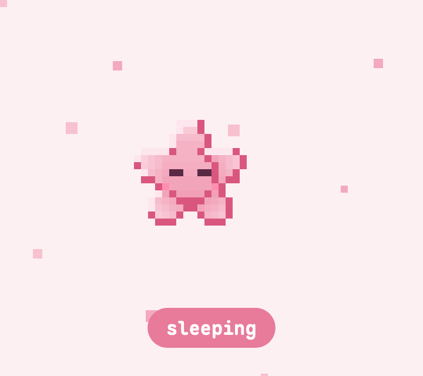
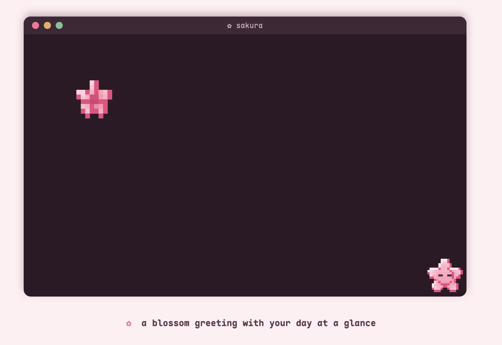
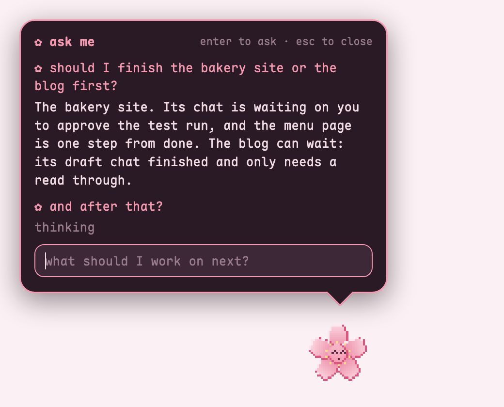
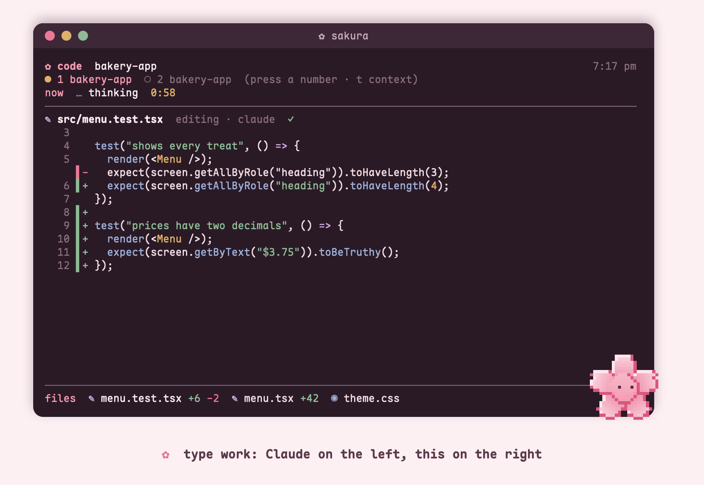
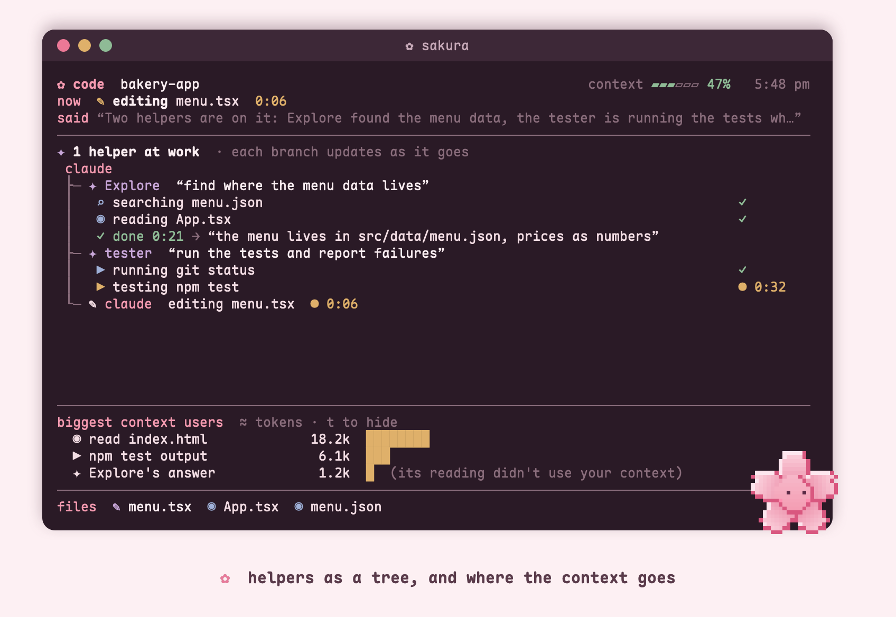
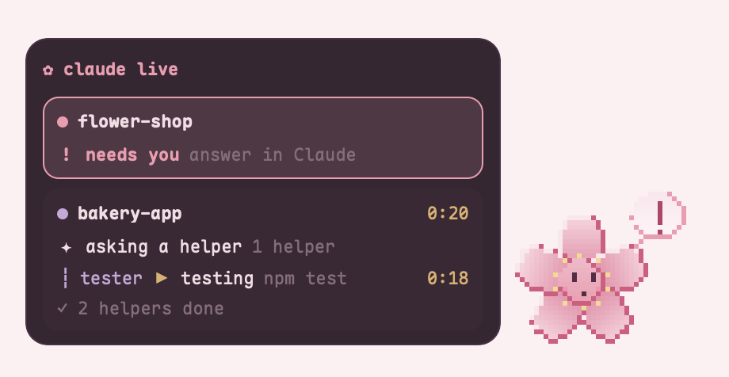

<div align="center">



# ✿ sakura terminal ✿

**a cherry blossom makeover for your Mac terminal,**<br>
**plus a tiny flower friend who tells you what Claude is up to**



</div>

<br>

## 🌸 install in 3 steps

**1.** You need a Mac with [Homebrew](https://brew.sh) (no? paste the one line from brew.sh into Terminal first) and zsh, the Mac's standard shell. [Claude Code](https://claude.com/claude-code) is needed for the pet, the code pane and `hub`; the look works without it.

**2.** Paste this into Terminal:

```bash
git clone https://github.com/marinasofia/sakura-terminal.git && cd sakura-terminal && ./install.sh
```

It shows you everything it will change and waits for your **y** before touching anything.

**3.** Open **Ghostty** and press **cmd + t**. Your blossom is waiting ✿

> Don't want the flower pet? Use `./install.sh --no-pet`<br>
> Want `hub` to see your terminals too? Use `./install.sh --shell-log` (off unless you ask)<br>
> Changed your mind? `./uninstall.sh` puts everything back.

<br>

## 🌸 your terminal, blooming

* **a greeting in every new window:** a pixel blossom opens up next to your day at a glance: your next todo, the repo you're in, how much of your Claude limits you've used, what your last chat got done, and the moon
* **cmd + /** opens a searchable menu of everything, so there's nothing to memorize. Pick one and it runs
* **a status line in Claude:** model, how full the chat is, your session and week limits, cost, and a forecast of when your session limit runs out
* **safer by default:** `what <command>` explains any command and rates it SAFE, CAREFUL or RISKY **before** you run it. Ghostty asks before pasting anything that would run by itself, and `checkup` checks FileVault, the firewall and Claude's sandbox in one screen
* **little helpers:** `todo`, `ask "..."` for a one line answer, `z` to jump to any folder you've visited, and `settings` to switch things on and off with the arrow keys

<br>

## 🌷 meet your flower

She floats in the corner of your screen and changes face while Claude Code works.

<table align="center">
<tr>
<td align="center"><br><b>sleeping</b><br><sub>nothing going on</sub></td>
<td align="center"><br><b>working</b><br><sub>Claude is busy</sub></td>
<td align="center"><br><b>needs you</b><br><sub>Claude has a question</sub></td>
<td align="center"><br><b>your turn</b><br><sub>Claude is done</sub></td>
<td align="center"><br><b>awake</b><br><sub>you're back</sub></td>
</tr>
</table>

**Click her and ask anything big-picture** in a little speech bubble: *"what needs me?"*, *"should I finish the bakery site or the blog first?"*, *"am I spreading myself too thin?"* She sees every Claude chat and your todos (and your terminals, if you turn that on), and answers in a few lines (dictation works too: press fn twice).

<div align="center"></div>

Drag her anywhere. **Option + click** jumps back to Ghostty. **cmd + alt + p** hides her. Type `pet test` to see every mood.

<br>

## 🌿 watch Claude work, live

**Type `work` in Ghostty** and one window becomes a little IDE: Claude on the left, a **code pane** on the right showing the file Claude is on, **new lines in green, removed lines in red**, plus its helper agents, every file it touched and the websites it visited. All inside Ghostty, next to your flower. (Already in a chat? Press **cmd + d** and type `live`.)

<div align="center"></div>

While helpers work, the pane turns into a **helper tree**: every helper's task, its steps as they happen, and its answer when done. The header shows how full the **context** is, and past 40% it lists which steps used the most of it (press **t** to show or hide).

<div align="center"></div>

Prefer something tiny? **cmd + alt + l** shows a small floating card next to the flower instead (press again for compact, then off). Type `replay` to watch a pretend chat play through either one.

<div align="center"></div>

It only reads the private activity log on your Mac and uses no tokens. Before each edit it keeps a private copy of the file (skipping secret files like `.env`, `*.pem` and `*.key`), deleted after 3 days.

<br>

## 🪷 one hub for every chat

Type `hub` and you get a Claude chat that can see **all your other chats** (and your terminal commands, if you turn on the terminal log in `settings`): ask it *"what needs me?"*, *"did the bakery chat finish? what changed?"* or *"summarize today"*. It reads short summaries, not whole logs, so it stays cheap.

## 🍃 fewer tokens, automatically

* **big-file guard:** Claude can't swallow a huge file whole; it's asked to search first and read just the part it needs (asking twice still works)
* **skips junk folders:** `node_modules`, `.venv`, `dist` and `build` are never read
* **helpers for big searches:** each chat is reminded that a helper's reading stays out of its own context
* **wrap-up nudge:** past 70% context, Claude suggests `/handoff` so the next chat starts small
* **short replies:** the `sakura` reply style explains in plain words and points to files instead of pasting code, since the code pane shows it (switch back with `/output-style`)
* type `tokens` to see where today's tokens went, and which chats grew too big

<br>

## 🌷 even better: Claude inside Cursor or VS Code

Want Claude's edits as real diffs you can **accept or reject**, in one window with your terminal? Use the editor you already have:

1. Install the extension: `cursor --install-extension anthropic.claude-code` (or `code --install-extension anthropic.claude-code`)
2. Run `claude` in the editor's terminal, or type `/ide` in a Claude chat in Ghostty to connect it
3. Make it pink: paste [`cursor/sakura-settings.json`](cursor/sakura-settings.json) into your editor settings (it follows your Mac's light and dark mode)

The code pane above still shines for watching helper agents and websites, and the flower works either way.

<br>

## 🎀 the only things to remember

| press or type | what happens |
| :--- | :--- |
| **cmd + /** | a searchable menu of everything. Forget the rest of this table, this is the one ✿ |
| `work` | Claude on the left, the live code pane on the right |
| `cl` | start Claude |
| `what <command>` | explains a command and how risky it is, **before** you run it |
| `todo add buy flowers` | a todo that shows up in every new window |
| `settings` | turn things on and off with the arrow keys |

<details>
<summary><b>every command</b></summary>

<br>

| Claude | |
| :--- | :--- |
| `cl` | Claude with your default model |
| `ccq` | quick and cheap (Haiku): small edits and questions |
| `cco` | Opus, for hard problems |
| `ccr` | pick up your last chat in this folder |
| `work` · `work myapp` | Claude + the code pane side by side, here or in a project you've visited |
| `live` | the code pane on its own · `live --timeline` every step · `live --last` your last chat in one screen |
| `hub` | one Claude chat that sees all your other chats |
| `tokens` · `tokens week` | where your tokens went, and which chats grew too big |
| `replay` | play a pretend chat to watch the code pane and panel |
| `/handoff` (in Claude) | save a short note, then `/clear`: the next chat in this project picks it up by itself |

| everyday | |
| :--- | :--- |
| `ask "regex for emails"` | a one line answer, no chat to manage |
| `what <command>` · `what` | explain a command before you run it, or explain your last one |
| `todo` · `todo add …` · `todo done 2` | your todo list, shown in every greeting |
| `z <folder>` | jump to any folder you've been in |
| `hello` | the greeting again |
| `settings` | greeting, animation, tips, terminal log, pet, panel, transparency, font size |
| `checkup` | FileVault, firewall, Claude sandbox, `.env` protection, updates |
| `update` · `update all` | patch Ghostty and these tools · every Homebrew package |
| `pet` · `pet test` | check the flower is connected · watch every mood |

| keys | |
| :--- | :--- |
| **cmd + /** | the menu |
| **cmd + d** · **cmd + shift + d** | split right · split down |
| **cmd + `** | drop down terminal, from any app |
| **cmd + alt + p** | hide or show the flower |
| **cmd + alt + l** | floating card: full, compact, off |
| **t** (in the code pane) | show or hide what's filling the context |
| **1** to **9** (in the code pane) | follow another chat |

</details>

<br>

## 🔒 safe by design

* **Private:** the activity log stays on your Mac, is readable only by you, hides anything that looks like a password or key, and clears itself after 3 days.
* **Opt in:** logging your own terminal commands (for `hub`) is off unless you say yes in the installer or turn it on in `settings`.
* **Read only helpers:** the flower's answers come from one Claude call with no tools and no MCP servers, and nothing it reads from other chats is treated as an instruction.
* **Careful:** nothing installs until you say yes, and every file it replaces is backed up first.
* **Claude stays in its lane:** the installer turns on Claude Code's sandbox and blocks it from reading your `.env` secrets.
* **Your stuff stays yours:** your Ghostty settings and your `CLAUDE.md` are never overwritten.

Exactly what is kept, where, for how long, and how to delete it: [SECURITY.md](SECURITY.md).

<details>
<summary><b>what exactly gets installed?</b></summary>

<br>

* **Homebrew tools:** Ghostty, Starship, eza, bat, zoxide, fzf, jq, zsh-autosuggestions, zsh-syntax-highlighting, the Maple Mono font, and Hammerspoon (for the pet)
* **Ghostty:** `~/.config/ghostty/sakura.ghostty` + the sakura night theme, loaded by one line in your config
* **Shell:** `~/.config/sakura` and a marked block at the end of `~/.zshrc`
* **Prompt:** `~/.config/starship.toml` (yours is backed up)
* **Claude Code:** `~/.claude/sakura` (status line + hooks), a `/handoff` skill, a `tester` agent, the `sakura` reply style, and in `~/.claude/settings.json`: the hooks, the sandbox, and a read block for `.env` files (anything of yours stays)
* **Pet:** `~/.hammerspoon/sakura_*.lua` (flower, ask bubble, live panel)

`work` opens its split with Ghostty 1.3 or newer (run `update` if yours is older). macOS may ask you to allow Hammerspoon (for the pet), Ghostty under Accessibility (for the **cmd + `** drop down terminal), and Ghostty under Automation (for `work`). All optional.

</details>

<details>
<summary><b>something not working?</b></summary>

<br>

* **Type `pet`.** It checks Hammerspoon, the Claude hooks and the code pane, and says what to fix
* **No flower?** Click the Hammerspoon icon in the menu bar › Reload Config. The first time, macOS asks you to allow Hammerspoon
* **The flower doesn't react?** Claude chats opened before installing need a restart
* **`work` doesn't split?** It needs Ghostty 1.3 or newer (`update`), and macOS asks once to let Ghostty control itself (System Settings › Privacy & Security › Automation)
* **The installer stopped at `settings.json`?** It only reads plain JSON. Remove any comments from `~/.claude/settings.json` and run it again
* **Greeting missing?** Your login shell must be zsh: `chsh -s /bin/zsh`

</details>

<details>
<summary><b>make it yours</b></summary>

<br>

* **Your name in the greeting:** add `SAKURA_NAME=Sam` to `~/.config/sakura/prefs.zsh`
* **Colors:** `~/.config/ghostty/themes/sakura-night`
* **Menu and tips:** `~/.config/sakura/actions.tsv` and `tips.txt`
* **Skip a feature:** `settings` turns off the greeting, the bloom animation, the tip line and the shortcut card
* **Recolored it?** `docs/make-gifs/make.sh` and `stills.sh` redraw these pictures from your setup

</details>

<br>

<div align="center">

[changelog](CHANGELOG.md) · [contributing](CONTRIBUTING.md) · [security](SECURITY.md)

made with ✿ by [Marina](https://github.com/marinasofia) · pet art by me · font: [Maple Mono](https://github.com/subframe7536/maple-font) · MIT

</div>
